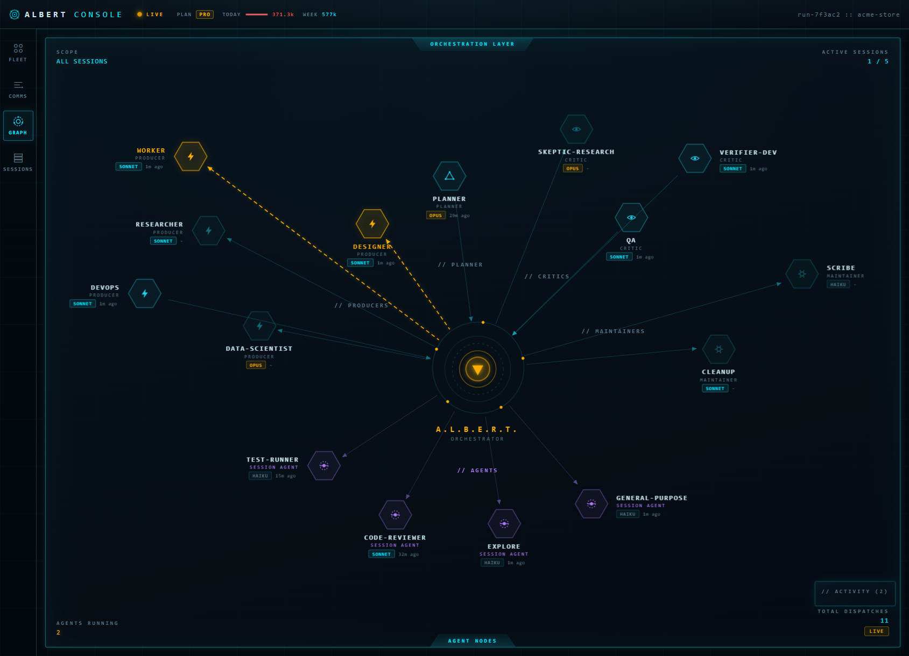
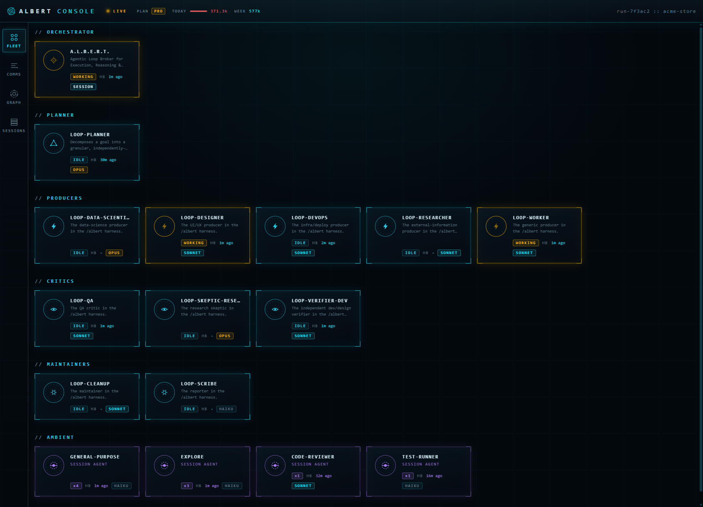
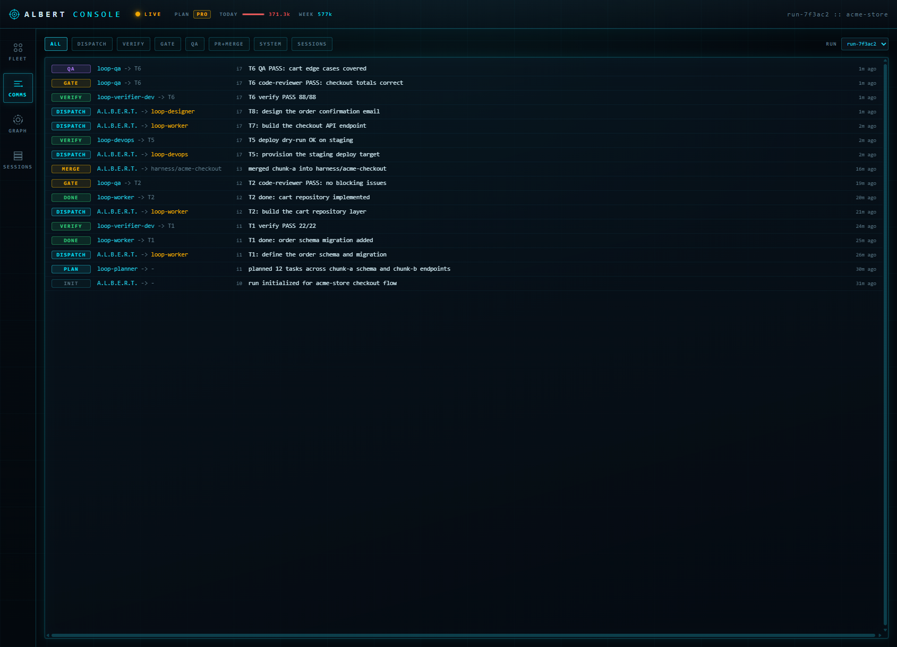
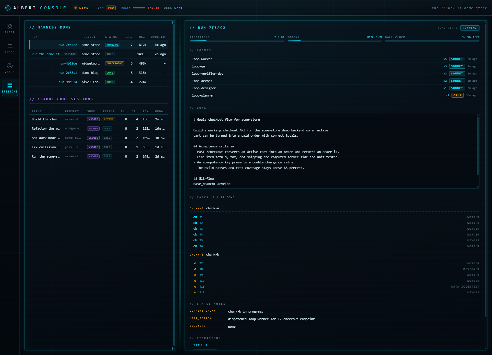

# Albert

**Give Claude Code a goal and walk away. A roster of specialized agents plans it, splits
the work, builds it in parallel, reviews and QAs its own output, and merges when the
critics sign off, while a live Stark-style HUD shows you every agent as it works.**



This repo is two cooperating pieces:

- **Albert** is a long-running autonomous harness for [Claude Code](https://claude.com/claude-code).
  You give it a goal in plain English. An orchestrator (**A.L.B.E.R.T.**, the Agentic Loop
  Broker for Execution, Reasoning & Tasking) decomposes it into tasks, assigns each to the
  cheapest model that can do it, fans them out concurrently in isolated git worktrees, runs
  independent verify / code-review / QA critics on every result, and merges the work when
  and only when those critics pass. It keeps going, iteration after iteration, until the
  goal is met or it hits a checkpoint you asked for.
- **The Albert Console** is a zero-dependency local dashboard that watches all of the
  above in real time, across every project on your machine, in a cyan-and-gold "agent OS"
  HUD.

Everything runs locally. The console is read-only and binds to `127.0.0.1` only.

---

## See it

**Fleet** — every agent as a card, grouped by role, with its model tier, live status, and
heartbeat.



**Comms** — a live feed of who dispatched what to whom (`A.L.B.E.R.T. -> loop-worker`,
`loop-verifier-dev -> A.L.B.E.R.T.`), streamed over Server-Sent Events.



**Sessions** — the full history of every run across every project: goal, status,
iterations, tokens, PRs merged, with drill-in to each run's task list and logs.



---

## Quickstart (Windows)

Requirements: **Windows 10/11**, **PowerShell 5.1+**, **Node 20+** (Node 26 recommended),
and **[Claude Code](https://claude.com/claude-code)** already installed and signed in.

```powershell
git clone https://github.com/Sdraugel/albert.git
cd albert
powershell -ExecutionPolicy Bypass -File .\install.ps1
```

The installer copies the harness (the `/albert` skill, the agent roster, the parallel
executor, and the event emitter) into your Claude Code config, resolves every machine-path
template token to your own home directory, and offers to register the console as an
always-on background task. Nothing personal from the author's machine is shipped or
installed; the installer generates everything from your environment.

Then, in any Claude Code session inside a project you want worked on:

```
/albert "Add pagination to the users API and cover it with tests"
```

Open the console at **http://localhost:4400** and watch it run.

To try the UI before you run anything real, boot it against the bundled synthetic demo
data:

```powershell
powershell -ExecutionPolicy Bypass -File .\install.ps1 -DemoOnly
```

To remove everything:

```powershell
powershell -ExecutionPolicy Bypass -File .\uninstall.ps1
```

---

## How it works

**Plan, then fan out.** `A.L.B.E.R.T.` sends the goal to a planner that writes a
dependency-ordered `tasks.json`, assigning each task a model tier (haiku / sonnet / opus)
and a disjoint file scope. Independent tasks in the same chunk then run **concurrently**,
each in its own git worktree, so a five-task chunk finishes in about the time of its slowest
task, not the sum.

**Producers never grade themselves.** Every producer result is checked by independent
critics before it counts: a verifier re-runs the task's checks from a clean tree, a QA agent
exercises real user journeys and edge cases, and for research work a skeptic tries to refute
the claimed result and rejects if uncertain. A task is done only with captured evidence.

**Merge on sign-off, gate the dangerous stuff.** With merging enabled, a chunk's PR merges
automatically once code-review and QA pass. Deploys, migrations, and other irreversible
steps stay gated behind an explicit `allow_deploy: true` in the goal, and `stop_after` gives
you a review checkpoint whenever you want one.

**Observability without hooks.** The console tails Claude Code's own session transcripts
plus the harness event stream. There are no hooks in your critical path. A single adapter is
the only thing that reads a transcript, and it emits an allowlist of structured metadata
only (agent types, counts, timings, token totals, run titles). Prompt and response bodies
are never read into the console or sent to the browser. Privacy is structural, not a
setting.

### The roster

| Class | Agents | Job |
|---|---|---|
| Orchestrator | `A.L.B.E.R.T.` | Decomposes the goal, assigns model tiers, routes results |
| Planner | `loop-planner` | Writes and re-writes the dependency-ordered task list |
| Producers | `loop-worker`, `loop-data-scientist`, `loop-designer`, `loop-researcher`, `loop-devops` | Do the actual work, one task at a time, in a fresh context |
| Critics | `loop-verifier-dev`, `loop-qa`, `loop-skeptic-research` | Independently verify, QA, and try to refute |
| Maintainers | `loop-cleanup`, `loop-scribe` | Keep the tree merge-ready; own the human-readable report |

The installer also bundles generic, self-contained copies of the general helper agents the
harness leans on (code review, security review, performance review, docs, refactor,
codebase search) so a fresh clone works out of the box.

---

## Configuration

Runs are configured through the goal itself and a small set of policy knobs the harness
reads from each run's `goal.md`:

- `merge_policy` — `none` (leave PRs open for you) or `auto_on_signoff` (merge when
  code-review and QA pass). Hands-free merging also requires you to grant a `gh pr merge`
  permission rule in your Claude Code settings.
- `allow_deploy` — `false` by default. Deploys and irreversible actions refuse to run
  without it.
- `stop_after` — insert a review checkpoint (for example, after the first PR).

---

## Privacy and security

The console is local-only and read-only, holds no credentials by default, and never
forwards transcript bodies to the browser. The harness runs autonomous agents that edit
code and (if you opt in) merge PRs, so run it on repos you can reset and review the goal
policy first. Full details, including the optional usage strip and the credential handling,
are in [SECURITY.md](SECURITY.md).

---

## License

This project is source-available under the **[PolyForm Noncommercial License 1.0.0](LICENSE.md)**.

You may use, modify, and share it for any noncommercial purpose, personal projects,
research, education, nonprofits, and government all qualify. You may **not** sell it or use
it for commercial advantage, and if you redistribute it you must keep the license and the
`Required Notice:` credit line intact.

Note this is a source-available license, not an OSI-approved "open source" license, because
it restricts commercial use. See [LICENSE.md](LICENSE.md) for the exact terms and
[NOTICE](NOTICE) for the credit requirement.

Contributions are welcome, see [CONTRIBUTING.md](CONTRIBUTING.md).
